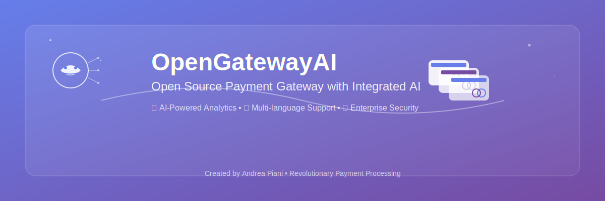

# 🚀 OpenGatewayAI - Open Source Payment Gateway Frontend



## 🌟 Overview

OpenGatewayAI is the world's first open-source payment gateway frontend with integrated artificial intelligence. Built with modern technologies and designed for scalability, it provides a comprehensive solution for payment processing with AI-powered insights and fraud detection.

**Created by Andrea Piani** - A revolutionary approach to payment gateway management.

🌐 **Live Demo**: [opengatewayai.andreapiani.com](https://opengatewayai.andreapiani.com)

📖 **Open Source**: This project is completely open source and available for the community to explore, contribute, and learn from. The frontend code is freely available under the MIT license, promoting innovation and collaboration in the fintech space.

## 🎯 Key Features

- 🤖 **AI-Powered Analytics**: Real-time fraud detection and transaction optimization
- 🌍 **Multi-language Support**: Arabic, English, and Italian localization
- 📊 **Advanced Dashboard**: Comprehensive analytics and reporting
- 🔒 **Security First**: Enterprise-grade security with PCI-DSS compliance
- 📱 **Responsive Design**: Works seamlessly on all devices
- ⚡ **Real-time Processing**: Instant transaction processing and notifications
- 🎨 **Modern UI/UX**: Clean, intuitive interface built with Tailwind CSS

## 🛠️ Technology Stack

### Frontend (Open Source)
- **React 18** with TypeScript for type-safe development
- **Vite** for lightning-fast development and building
- **Tailwind CSS** for modern, responsive styling
- **React Router** for seamless navigation
- **Lucide React** for beautiful, consistent icons
- **i18next** for internationalization
- **Chart.js** for data visualization

### Backend (Available on Commission)
- **Node.js** with Express.js or **Python** with FastAPI
- **PostgreSQL** or **MongoDB** for data persistence
- **Redis** for caching and session management
- **Docker** for containerization
- **Kubernetes** for orchestration
- **AI/ML Integration** with TensorFlow or PyTorch

## 🏗️ Project Structure

```
OpenGatewayAI/
├── src/
│   ├── components/          # Reusable UI components
│   │   ├── admin/          # Admin-specific components
│   │   ├── merchant/       # Merchant-specific components
│   │   ├── ai/            # AI-powered components
│   │   ├── charts/        # Data visualization components
│   │   └── shared/        # Shared components
│   ├── pages/             # Main application pages
│   │   ├── AdminDashboard.tsx
│   │   ├── MerchantDashboard.tsx
│   │   ├── LoginPage.tsx
│   │   └── LandingPage.tsx
│   ├── contexts/          # React contexts for state management
│   ├── i18n/             # Internationalization files
│   │   └── locales/      # Translation files (ar, en, it)
│   └── assets/           # Static assets and images
├── public/               # Public assets
└── docs/                # Documentation
```

## 🚀 Quick Start

### Prerequisites
- Node.js 18+ and npm/yarn
- Git

### Installation

1. **Clone the repository**
   ```bash
   git clone https://github.com/your-username/OpenGatewayAI.git
   cd OpenGatewayAI
   ```

2. **Install dependencies**
   ```bash
   npm install
   # or
   yarn install
   ```

3. **Start development server**
   ```bash
   npm run dev
   # or
   yarn dev
   ```

4. **Open your browser**
   Navigate to `http://localhost:5173`

### Demo Credentials

**Admin Panel:**
- Email: `admin@opengateway.ai`
- Password: `admin123`

**Merchant Panel:**
- Email: `merchant@opengateway.ai`
- Password: `merchant123`

## 💼 Business Model

### Open Source Frontend
The frontend is completely open source and free to use. This includes:
- Complete UI/UX components
- Dashboard and analytics views
- Multi-language support
- Basic integrations

### Custom Backend Development
We offer **professional backend development services** on commission:

- 🏦 **Payment Processing Engine**: Complete transaction processing system
- 🤖 **AI Integration**: Custom machine learning models for fraud detection
- 🔌 **POS Integration**: Connect with any Point of Sale system
- 🌐 **API Development**: RESTful and GraphQL APIs
- 🔒 **Security Implementation**: PCI-DSS compliance and encryption
- ☁️ **Cloud Deployment**: AWS, Azure, or Google Cloud setup
- 📊 **Analytics Engine**: Real-time reporting and business intelligence

### POS Integration Support
We can integrate OpenGatewayAI with:
- Traditional POS terminals
- Mobile POS solutions
- E-commerce platforms
- Custom hardware solutions
- Legacy banking systems

## 🤝 Contributing

We welcome contributions! Please see our [Contributing Guide](CONTRIBUTING.md) for details.

1. Fork the repository
2. Create your feature branch (`git checkout -b feature/AmazingFeature`)
3. Commit your changes (`git commit -m 'Add some AmazingFeature'`)
4. Push to the branch (`git push origin feature/AmazingFeature`)
5. Open a Pull Request

## 📄 License

This project is licensed under the MIT License - see the [LICENSE](LICENSE) file for details.

## 📞 Contact & Support

**Andrea Piani** - Creator & Lead Developer
- 📧 Email: [andrea@opengateway.ai](mailto:andrea@opengateway.ai)
- 💼 LinkedIn: [Andrea Piani](https://linkedin.com/in/andrea-piani)
- 🐙 GitHub: [@andreapiani](https://github.com/andreapiani)

### Custom Backend Development
Interested in a custom backend solution? Contact us for:
- Free consultation
- Custom quotes
- Technical specifications
- Integration planning

## 🌟 Why Choose OpenGatewayAI?

- **Proven Technology**: Built with industry-standard tools and practices
- **AI-First Approach**: Leverage artificial intelligence for better business decisions
- **Scalable Architecture**: Grows with your business needs
- **Expert Support**: Professional development team available
- **Cost-Effective**: Open source frontend reduces development costs
- **Rapid Deployment**: Get started quickly with our pre-built components

---

⭐ **Star this repository** if you find it useful!

🚀 **Ready to revolutionize your payment processing?** Contact us today!

An open-source payment gateway frontend with integrated AI, built with React, TypeScript and Tailwind CSS.

## 📋 Overview

This application is an open-source frontend for a payment gateway with integrated AI capabilities. It includes separate dashboards for administrators and merchants, with complete transaction management, analytics and configuration features.

## 🚀 Technologies Used

- **Frontend Framework**: React 18.3.1 with TypeScript
- **Build Tool**: Vite 5.4.2
- **Styling**: Tailwind CSS 3.4.1
- **Routing**: React Router DOM 6.20.1
- **Charts**: Chart.js 4.4.0 + React-ChartJS-2 5.2.0
- **Icons**: Lucide React 0.344.0
- **Linting**: ESLint 9.9.1

## 📁 Project Structure

```
src/
├── components/
│   ├── admin/                 # 👨‍💼 Admin dashboard components
│   │   ├── AdminHeader.tsx
│   │   ├── AdminOverview.tsx
│   │   ├── AdminSidebar.tsx
│   │   ├── CommissionSettings.tsx
│   │   ├── MerchantManagement.tsx
│   │   ├── ReportsAnalytics.tsx
│   │   ├── SystemSettings.tsx
│   │   └── TransactionManagement.tsx
│   ├── charts/                # 📊 Chart and analytics components
│   │   ├── FraudDetectionChart.tsx
│   │   ├── GeographicChart.tsx
│   │   ├── MerchantPerformanceChart.tsx
│   │   ├── PaymentMethodsChart.tsx
│   │   ├── RevenueChart.tsx
│   │   └── TransactionChart.tsx
│   ├── merchant/              # 🏪 Merchant dashboard components
│   │   ├── AccountSettings.tsx
│   │   ├── MerchantHeader.tsx
│   │   ├── MerchantOverview.tsx
│   │   ├── MerchantSidebar.tsx
│   │   ├── PaymentRequests.tsx
│   │   ├── SupportTickets.tsx
│   │   └── TransactionHistory.tsx
│   ├── shared/                # 🔄 Shared components
│   │   └── StatsCard.tsx
│   └── ProtectedRoute.tsx     # 🔒 Role-based route protection
├── contexts/
│   └── AuthContext.tsx        # 🔐 Authentication context
├── pages/
│   ├── AdminDashboard.tsx     # 👨‍💼 Admin dashboard
│   ├── LandingPage.tsx        # 🏠 Landing page
│   ├── LoginPage.tsx          # 🔑 Login page
│   └── MerchantDashboard.tsx  # 🏪 Merchant dashboard
├── App.tsx                    # ⚛️ Main component
├── main.tsx                   # 🚀 Entry point
├── index.css                  # 🎨 Global styles
└── vite-env.d.ts             # 📝 TypeScript definitions for Vite
```

## 🔐 Authentication System

The application uses a mock authentication system with two roles:

### 🎭 Demo Credentials:

**👨‍💼 Administrator:**
- Email: `admin@opengateway.ai`
- Password: `admin123`
- Access: Complete admin dashboard

**🏪 Merchant:**
- Email: `merchant@example.com`
- Password: `merchant123`
- Access: Merchant dashboard

## 🎯 Key Features

### 👨‍💼 Admin Dashboard
- 📊 **Overview**: System-wide statistics and insights
- 🏪 **Merchant Management**: CRUD operations for merchants and configurations
- 💳 **Transaction Management**: Monitor and manage all transactions
- 💰 **Commission Settings**: Configure fees and commission structures
- 📈 **Reports & Analytics**: Detailed charts and business intelligence
- ⚙️ **System Settings**: Global system configurations

### 🏪 Merchant Dashboard
- 📊 **Overview**: Personal merchant statistics and KPIs
- 📋 **Transaction History**: View and filter transaction records
- 💸 **Payment Requests**: Create and manage payment requests
- ⚙️ **Account Settings**: Personal account configurations
- 🎫 **Support Tickets**: Integrated support system

### 📊 Chart Components
- 📈 **Revenue Chart**: Revenue trends and analytics
- 🔍 **Fraud Detection**: AI-powered fraud detection insights
- 🌍 **Geographic Chart**: Geographic transaction distribution
- 📊 **Merchant Performance**: Individual merchant performance metrics
- 💳 **Payment Methods**: Payment method usage statistics
- 📉 **Transaction Chart**: Transaction volume and trends

## 🛠️ Setup & Installation

### 📋 Prerequisites
- Node.js (version 16 or higher) 🟢
- npm or yarn 📦

### 🚀 Installation

```bash
# Clone the repository
git clone [repository-url]
cd "OpenGatewayAI"

# Install dependencies
npm install

# Start development server
npm run dev

# Build for production
npm run build

# Preview production build
npm run preview

# Run linting
npm run lint
```

## 🌐 Routing

The application uses React Router with the following routes:

- 🏠 `/` - Landing page
- 🔑 `/login` - Login page
- 👨‍💼 `/admin/*` - Admin dashboard (protected)
- 🏪 `/merchant/*` - Merchant dashboard (protected)

### 👨‍💼 Admin Routes (`/admin/*`)
- 📊 `/admin/` - Overview dashboard
- 🏪 `/admin/merchants` - Merchant management
- 💳 `/admin/transactions` - Transaction management
- 💰 `/admin/commissions` - Commission settings
- 📈 `/admin/reports` - Reports & analytics
- ⚙️ `/admin/settings` - System settings

### 🏪 Merchant Routes (`/merchant/*`)
- 📊 `/merchant/` - Overview dashboard
- 📋 `/merchant/transactions` - Transaction history
- 💸 `/merchant/payments` - Payment requests
- ⚙️ `/merchant/settings` - Account settings
- 🎫 `/merchant/support` - Support tickets

## 🎨 Design System

- **CSS Framework**: Tailwind CSS 🎨
- **Color Palette**: Blue/indigo gradient for primary theme 🔵
- **Icons**: Lucide React for consistent iconography ✨
- **Layout**: Responsive design with collapsible sidebar 📱
- **Typography**: Optimized system font stack 📝

## 🔒 Security

- **Route Protection**: `ProtectedRoute` component for access control 🛡️
- **Role-based Access**: User role-based access control 👥
- **Context Security**: Secure authentication state management 🔐

## 📱 Responsive Design

- Mobile-first design approach 📱
- Collapsible sidebar for mobile devices 📲
- Adaptive layout for tablet and desktop 💻
- Touch optimization for mobile devices ✋

## 🚀 Performance

- **Vite**: Fast build tool with HMR ⚡
- **Code Splitting**: Automatic route lazy loading 📦
- **Optimizations**: Optimized Vite configuration 🔧
- **Bundle Size**: Optimized dependencies 📊

## 🧪 Development

### 📜 Available Scripts

```bash
npm run dev      # 🔥 Development server
npm run build    # 🏗️ Production build
npm run preview  # 👀 Preview build
npm run lint     # 🔍 Code linting
```

### ⚙️ Configurations

- **TypeScript**: Strict mode configuration 📝
- **ESLint**: React and TypeScript rules 🔍
- **Tailwind**: Custom configuration 🎨
- **Vite**: React optimizations ⚡

## 📄 License

Demo project for Immaginet Srl - All rights reserved. 📋

## 👥 Contributing

To contribute to the project:

1. 🍴 Fork the repository
2. 🌿 Create a feature branch (`git checkout -b feature/AmazingFeature`)
3. 💾 Commit your changes (`git commit -m 'Add some AmazingFeature'`)
4. 📤 Push to the branch (`git push origin feature/AmazingFeature`)
5. 🔄 Open a Pull Request

## 📞 Support

For technical support or project questions, contact the development team. 💬

---

**⚠️ Note**: This is a frontend demo. For a complete implementation, you would need:
- 🔧 Backend API for data management
- 🗄️ Database for persistence
- 💳 Integration with real payment processors
- 🔐 Robust authentication system
- 🛡️ Advanced security measures